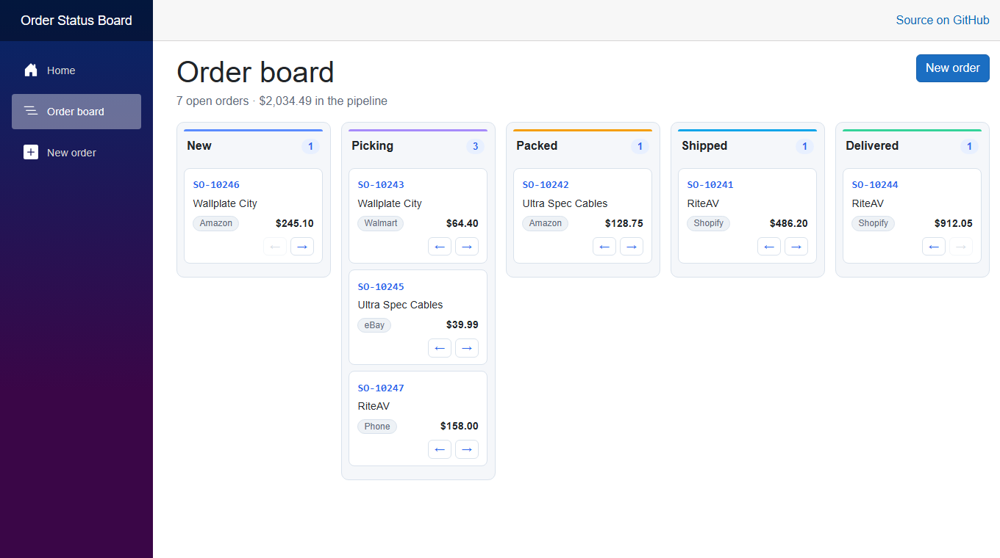
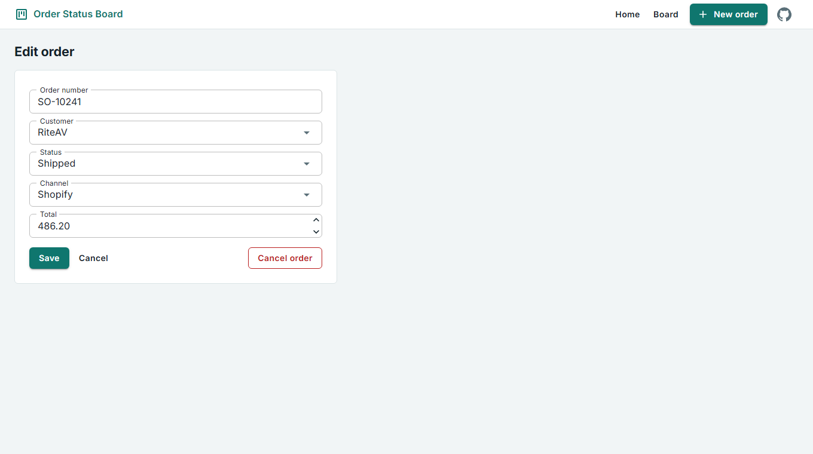

# Order Status Board

See where every order stands. Place an order, move it along its lifecycle, and read
the whole pipeline at a glance. Built to demonstrate EF Core relationships and
lookup-table design on SQL Server.



## The problem it solves

Order status usually lives in a spreadsheet column that anyone can type into, so the
same stage ends up recorded as "Shipped", "shipped" and "Shiped" — and no query can
group them again. This app makes the set of valid stages a **database constraint**:

- Status is a **lookup table**, not free text, so a stage cannot be misspelled into existence
- Each stage carries a `SortOrder`, so the board's column order is data rather than markup
- Renaming a stage is one row update, not a bulk string replace
- Cancelling an order **hides it and keeps the row**, so history survives

## Features

Implemented today:

- A board with one column per status, generated from the lookup table
- Move an order forward or back a column; the end columns disable the arrow that has nowhere to go
- Add and edit orders, with server-side validation from data annotations
- Duplicate order numbers rejected by a unique index
- Cancel an order behind a two-step confirm (soft delete)
- A running count and pipeline total above the board
- Responsive — columns stack instead of scrolling sideways at phone width

Not implemented: search, filtering, paging, authentication, order lines, and a screen
for cancelled orders. See [Project status](#project-status).



## Technology stack

| Layer | Choice |
|---|---|
| Framework | .NET 10, Blazor Server (Interactive Server rendering) |
| UI | MudBlazor 9.9.0 |
| Data access | Entity Framework Core 10 |
| Database | SQL Server — LocalDB in development |

**There is no HTTP API in this project, and no Swagger/OpenAPI.** It is a
server-rendered Blazor application: the Razor components query EF Core directly
through an injected `IDbContextFactory<BoardDbContext>`. There are no controllers or
minimal-API endpoints to call from outside the app.

## Solution structure

| Project | Holds |
|---|---|
| `OrderStatus.Web` | Blazor Server app — the board, the order form, layout and startup |
| `OrderStatus.Data` | `BoardDbContext`, the `Order`, `Customer` and `OrderState` models, EF Core migrations |

The project reference points **one way only**: Web references Data, never the reverse.

The context is registered with `AddDbContextFactory`, not `AddDbContext`. Blazor
Server components are long-lived and several can run at once, so each operation
creates its own short-lived context instead of sharing one.

## Requirements

- Visual Studio 2026 with the ASP.NET and web development workload
- .NET 10 SDK
- SQL Server LocalDB (installed with that workload) — or any SQL Server instance

## Getting it running

1. Open `OrderStatusBoard.sln` in Visual Studio 2026.
2. Right-click **`OrderStatus.Web`** → **Manage User Secrets**, and add a connection
   string named `BoardDatabase` pointing at your LocalDB instance
   (`(localdb)\MSSQLLocalDB`) with the database named `OrderStatusBoard`.
   `appsettings.json` keeps the key with a blank value so the shape is documented
   without a credential in the repository.
3. Apply the migration. In **Package Manager Console** set **Default project** to
   `OrderStatus.Data` **and** make sure the **startup project is `OrderStatus.Web`** —
   the EF Core tools and the connection string both live there — then run:

   ```powershell
   Update-Database
   ```

4. Press F5 and open `/orders`.

The database is **not** created automatically at startup; step 3 is required on a
fresh clone. Five statuses and three customers are seeded by the migration, so the
board has its columns and the customer dropdown is never empty on first run.

Full setup detail, including the CLI equivalent of every step, is in
[docs/getting-started.md](docs/getting-started.md).

## Documentation

| Document | Covers |
|---|---|
| [docs/getting-started.md](docs/getting-started.md) | Setup from a fresh clone, how to verify it works, current deployment state |
| [docs/architecture.md](docs/architecture.md) | Projects, layers, rendering model, how the lookup table drives the board |
| [docs/database.md](docs/database.md) | Schema, entities, relationships, the lookup table, migrations, seed data, ER diagram |

Being written next: configuration and troubleshooting.

## Project status

Working and complete for what it sets out to prove: three related tables, two foreign
keys, a lookup table driving the UI, and a board that reads and writes. It is a
portfolio project rather than a product, and is not deployed to a public URL — it runs
locally against LocalDB.

What I would add next:

- Filter the board by channel or customer
- A view for cancelled orders, with a way to reinstate one
- Order lines, so an order is master-detail rather than a single total
- Unit tests over the move logic

## License

MIT — see [LICENSE](LICENSE).

---

Self-directed portfolio project.
