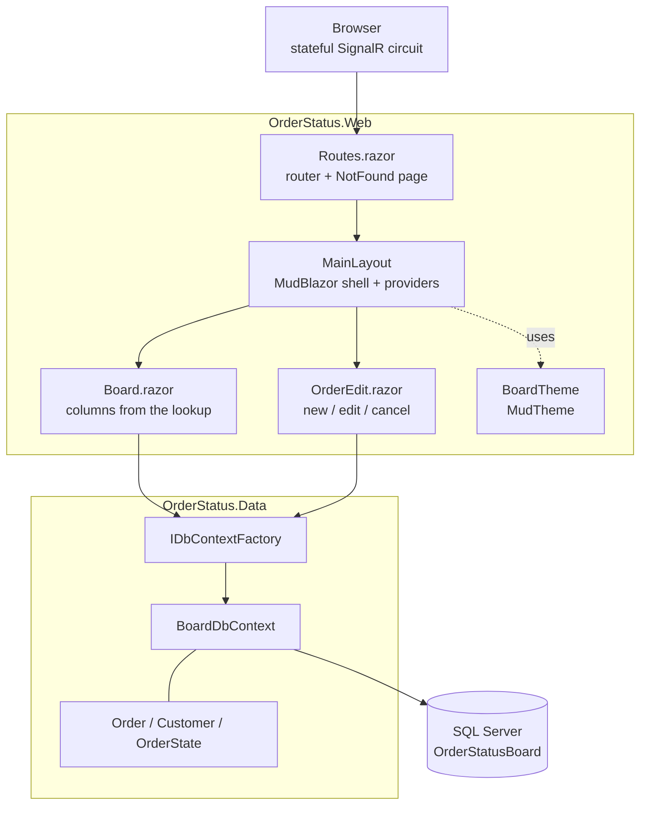

# Architecture

How Order Status Board is put together, and why it is arranged this way.

This describes the code as it exists today. Ideas that are not built are collected
under [Recommendations](#recommendations) at the end so they cannot be mistaken for
current behavior.

## Shape of the solution

Two projects, and the reference points one way only.

| Project | Type | Responsibility |
|---|---|---|
| `OrderStatus.Web` | `Microsoft.NET.Sdk.Web` | The board, the order form, layout, theme, startup and configuration |
| `OrderStatus.Data` | `Microsoft.NET.Sdk` class library | `Order`, `Customer` and `OrderState`, `BoardDbContext`, EF Core migrations |

`OrderStatus.Web` references `OrderStatus.Data`. **`OrderStatus.Data` references
nothing from the web project**, and must not — that rule is what keeps the data layer
reusable and testable on its own.

## How a request flows



There is **no HTTP API layer** — no controllers, no minimal-API endpoints, no
Swagger/OpenAPI. The browser holds a circuit and the components on the server do the
work.

## Rendering model

Blazor Server with **Interactive Server** rendering, applied globally in `App.razor`.
Components run on the server; the browser holds a SignalR connection and receives DOM
diffs.

Two consequences worth knowing:

- **Component state lives on the server between events.** `OrderEdit` loads an order
  and that object stays in server memory while the user types, which is why the form
  can bind five fields and still save the original `PlacedUtc` and `IsCancelled`.
- **Connections drop.** `ReconnectModal.razor` is the stock overlay shown while the
  circuit rejoins.

## Startup and pipeline

All configuration is in `Program.cs`; there is no `Startup.cs`.

| Registration | Purpose |
|---|---|
| `AddRazorComponents().AddInteractiveServerComponents()` | Blazor Server |
| `AddMudServices()` | MudBlazor — required for dialogs, snackbars, popovers |
| `AddDbContextFactory<BoardDbContext>(...UseSqlServer(...))` | Data access |

Pipeline, in order:

1. `UseExceptionHandler("/Error")` and `UseHsts()` — **non-development only**
2. `UseStatusCodePagesWithReExecute("/not-found")`
3. `UseHttpsRedirection()`
4. `UseAntiforgery()`
5. `MapStaticAssets()`
6. `MapRazorComponents<App>().AddInteractiveServerRenderMode()`

Note what is **absent**: no `Migrate()` or `EnsureCreated()`. The app never creates or
upgrades its own database. See
[database.md](database.md#database-initialization).

## Data access

`IDbContextFactory<BoardDbContext>` is injected into the Razor components, and each
operation opens its own short-lived context:

```csharp
await using var db = await DbFactory.CreateDbContextAsync();
```

**The factory is not a stylistic choice.** Blazor Server components are long-lived and
several can run at once, so a single scoped `DbContext` gets shared across overlapping
operations and throws *"a second operation was started on this context"*
intermittently.

There is **no service or repository layer**. Components hold their own queries. For an
app this size that is the honest structure — a repository wrapping EF Core is a second
abstraction over something already abstract. `DbSet<T>` and `IQueryable<T>` are the
repository.

## The lookup table drives the UI

This is the part worth understanding, and the reason the app exists.

The board's columns are **not** written in markup. `Board.razor` loads `OrderStates`
ordered by `SortOrder` and renders one column per row returned:

```csharp
states = await db.OrderStates
    .AsNoTracking()
    .OrderBy(s => s.SortOrder)
    .ToListAsync();
```

Each column takes its heading, its position and its accent color from that row. Three
things follow:

- **Adding a stage is a data change**, not a code change — insert a row with the right
  `SortOrder`.
- **Renaming a stage is one row update.** No orders need touching, because they hold a
  foreign key rather than a string.
- **Without seeded statuses the board has no columns at all.** Seeding is structural
  here, not a convenience.

### Moving an order between columns

The move looks up its neighbour **by `SortOrder`**, never by id:

```csharp
var target = await db.OrderStates
    .FirstOrDefaultAsync(s => s.SortOrder == order.OrderState.SortOrder + direction);
```

Ids stop matching board order the moment a stage is inserted later — a new stage
squeezed between Packed and Shipped gets id 6 while sitting third from the end.
`SortOrder` is the only field that reliably describes "the next column".

The arrows are disabled at the ends by asking the same question of the already-loaded
list, so no extra query is needed:

```csharp
private bool CanMove(OrderState state, int direction) =>
    states is not null && states.Any(s => s.SortOrder == state.SortOrder + direction);
```

## Pages and routing

| Route | Component | Does |
|---|---|---|
| `/` | `Pages/Home.razor` | Landing page describing the app |
| `/orders` | `Pages/Board.razor` | The board — columns from the lookup, move orders, running total |
| `/orders/new` | `Pages/OrderEdit.razor` | Create — same component, no `Id` |
| `/orders/edit/{Id:int}` | `Pages/OrderEdit.razor` | Edit, and cancel behind a confirm |
| `/not-found` | `Pages/NotFound.razor` | Re-executed target for non-200 status codes |
| `/Error` | `Pages/Error.razor` | Unhandled exception page, non-development only |

**One component serves both create and edit.** `OrderEdit` carries two `@page`
directives and branches on whether `Id` is null. A new order is given the first
column's status so it lands at the start of the board.

## UI layer

MudBlazor 9.9.0. `MainLayout.razor` hosts the four required providers —
`MudThemeProvider`, `MudPopoverProvider`, `MudDialogProvider`, `MudSnackbarProvider`.

`BoardTheme.cs` holds the `MudTheme`: teal on a white app bar, Inter, top navigation
with no drawer, flat bordered surfaces, 6px radius. Each app in the portfolio gets a
distinct identity so they do not read as one template with the words swapped.

**`wwwroot/app.css` is genuinely load-bearing here**, unlike a stock template
stylesheet. It holds the board's CSS grid (`.board-scroll`, `.board-column`,
`.column-head`), the media query that stacks columns instead of scrolling sideways at
640px, and the `#blazor-error-ui` styling. Do not treat it as removable.

## Validation

Two layers, both server-side:

1. **Data annotations on the models** drive the form through
   `<DataAnnotationsValidator />` — `[Required]`, `[MaxLength]`, `[Range]`,
   `[EmailAddress]` on `Customer.Email`.
2. **The database** enforces what annotations cannot — the unique order number and
   both foreign keys.

`[Range(1, int.MaxValue)]` on `CustomerId` and `OrderStateId` is what stops the
"-- choose a customer --" placeholder, whose value is `0`, being submitted.

## Error handling

| Situation | Handling |
|---|---|
| Unhandled exception | `UseExceptionHandler("/Error")` — production only |
| Unknown URL | `UseStatusCodePagesWithReExecute("/not-found")` |
| Unknown order id | `OrderEdit` redirects to `/orders` rather than rendering an empty form |
| Duplicate order number | `DbUpdateException` whose inner `SqlException` is 2601/2627; message shown, typed values kept |
| Any other save failure | Generic message on screen, real exception written to the log |
| Circuit dropped | `ReconnectModal` overlay |

`BlazorDisableThrowNavigationException` is `true` in the csproj, so `NavigateTo`
during a lifecycle method does not throw — which the unknown-id redirect relies on.

## Authentication and external services

**Neither exists.** No authentication, no authorization, no external API calls, no
email, no file storage. The only thing the app talks to is its own SQL Server
database, and every page is public.

## Patterns actually in use

- **Separated data project** with a one-way reference
- **Factory-per-operation** for `DbContext`, forced by the Blazor Server model
- **Lookup table driving presentation** — column order, labels and colors are data
- **Soft delete** via `IsCancelled`, with the board query filtering it out
- **Shared create/edit component** driven by an optional route parameter
- **`AsNoTracking` on read paths** — nothing tracked unless it will be saved

Not used and not needed here: repository, unit of work, CQRS, MediatR, AutoMapper,
DTOs.

## Recommendations

**None of the following is implemented.**

| Recommendation | Why |
|---|---|
| Move board queries into a service in the Data project | Worth it once a second screen needs the same query, or the move logic needs testing without a browser |
| Add a test project | There is none. The move-by-`SortOrder` logic is the obvious first target |
| Add a concurrency token | Two people editing the same order silently overwrite each other |
| Group orders by status in SQL rather than in memory | The board currently loads every open order and groups client-side; fine at this size, not at scale |

### Cleanup done while documenting

Two leftovers from before the MudBlazor restyle, both **fixed**:

1. **`wwwroot/lib/bootstrap/` was dead weight** — 16 CSS files that nothing
   referenced. `App.razor` links only `app.css`, the scoped stylesheet, Inter and
   MudBlazor. Deleted.
2. **`Error.razor` styled its headings with `text-danger`**, a Bootstrap class, in an
   app where Bootstrap is not linked — so it resolved to nothing and the headings were
   not even red. Both `Error.razor` and `NotFound.razor` are now MudBlazor pages
   consistent with the rest of the app.

`app.css` was **kept** — see the UI layer section above. It is live code here.
