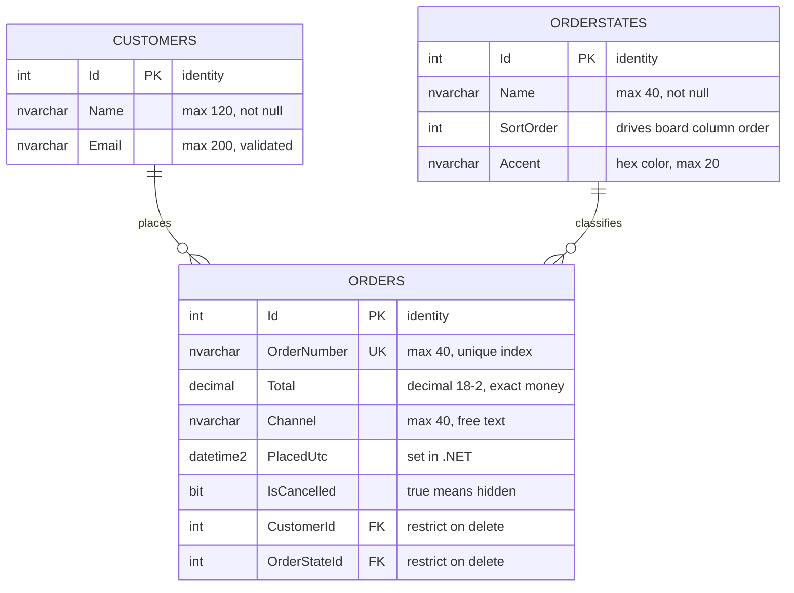

# Database

How Order Status Board stores its data: the schema, the EF Core configuration behind
it, and the behavior that follows from both.

Everything here describes the code as it exists. Anything not yet built is kept in
[Not implemented](#not-implemented) at the end, so it cannot be mistaken for current
behavior.

## At a glance

| | |
|---|---|
| Engine | SQL Server (LocalDB in development) |
| ORM | Entity Framework Core 10.0.11, SQL Server provider |
| Context | `BoardDbContext` in `OrderStatus.Data` |
| Tables | `Customers`, `OrderStates`, `Orders` |
| Migrations | One — `20260826134716_InitialCreate` |
| Seed data | 5 statuses and 3 customers, inserted by the migration |
| Auto-created at startup | **No** — the migration must be applied manually |

## Connection

The connection string is named **`BoardDatabase`** and the database is named
**`OrderStatusBoard`**.

It is read in `Program.cs`:

```csharp
builder.Services.AddDbContextFactory<BoardDbContext>(options =>
    options.UseSqlServer(
        builder.Configuration.GetConnectionString("BoardDatabase")));
```

The real value lives in **User Secrets only**. `appsettings.json` carries the key with
an empty string so the setting's shape is documented without putting a credential in
the repository.

`AddDbContextFactory`, not `AddDbContext`: Blazor Server components are long-lived and
several can be doing work at the same moment, so a shared scoped context throws
*"a second operation was started on this context"* intermittently. Every page opens
its own short-lived context instead.

## Entities

All three live in `OrderStatus.Data/Models`. Column types are the ones the migration
creates.

### Order

| Property | CLR type | Column | Rules |
|---|---|---|---|
| `Id` | `int` | `int`, identity, PK | |
| `OrderNumber` | `string` | `nvarchar(40)`, not null | **Unique index.** Required, max length 40 |
| `Total` | `decimal` | `decimal(18,2)`, not null | Range 0–999,999 |
| `Channel` | `string` | `nvarchar(40)`, not null | Defaults to `"Shopify"`; the form offers a fixed list |
| `PlacedUtc` | `DateTime` | `datetime2`, not null | Set in .NET, not by the database |
| `IsCancelled` | `bool` | `bit`, not null | `true` means cancelled and hidden from the board |
| `CustomerId` | `int` | `int`, not null, FK | Must be 1 or greater |
| `OrderStateId` | `int` | `int`, not null, FK | Must be 1 or greater |

### Customer

| Property | CLR type | Column | Rules |
|---|---|---|---|
| `Id` | `int` | `int`, identity, PK | |
| `Name` | `string` | `nvarchar(120)`, not null | Required |
| `Email` | `string` | `nvarchar(200)`, not null | Required, `[EmailAddress]` |
| `Orders` | `List<Order>` | — | Collection navigation |

### OrderState — the lookup

| Property | CLR type | Column | Rules |
|---|---|---|---|
| `Id` | `int` | `int`, identity, PK | |
| `Name` | `string` | `nvarchar(40)`, not null | Required |
| `SortOrder` | `int` | `int`, not null | **Drives the left-to-right board column order** |
| `Accent` | `string` | `nvarchar(20)`, not null | Hex color for the column's top border |
| `Orders` | `List<Order>` | — | Collection navigation |

`Channel` is deliberately **not** a lookup table. It is a short fixed list held in the
component (`Shopify`, `Amazon`, `Walmart`, `eBay`, `Phone`) and stored as text. Status
earned a table because the board's structure depends on it and stages get renamed;
channel does neither.

## Schema



An order belongs to exactly one customer and sits in exactly one status.

## Relationships and delete behavior

Two foreign keys, both configured explicitly, and **both `Restrict`**:

```csharp
modelBuilder.Entity<Order>()
    .HasOne(o => o.Customer)
    .WithMany(c => c.Orders)
    .HasForeignKey(o => o.CustomerId)
    .OnDelete(DeleteBehavior.Restrict);

modelBuilder.Entity<Order>()
    .HasOne(o => o.OrderState)
    .WithMany(s => s.Orders)
    .HasForeignKey(o => o.OrderStateId)
    .OnDelete(DeleteBehavior.Restrict);
```

A customer with orders cannot be deleted, and **a status still holding orders cannot
be deleted either**. The second one is the important guard: without it, deleting a
status would cascade and take real orders with it. EF Core's default for a required
relationship is cascade delete, so this had to be stated.

## Indexes

| Index | Table | Columns | Unique |
|---|---|---|---|
| `PK_Customers` / `PK_OrderStates` / `PK_Orders` | each | `Id` | yes |
| `IX_Orders_OrderNumber` | `Orders` | `OrderNumber` | **yes** |
| `IX_Orders_CustomerId` | `Orders` | `CustomerId` | no |
| `IX_Orders_OrderStateId` | `Orders` | `OrderStateId` | no |

### The same soft-delete consequence as the SKU app

**`IX_Orders_OrderNumber` has no filter, so it covers cancelled orders too.**
Cancelling sets `IsCancelled = true` and leaves the row in place, and that row keeps
its order number reserved. Reusing the number of a cancelled order is rejected as a
duplicate even though the order is invisible on the board.

That is a consequence of soft delete, not a defect — the number really is still in use
by a record that still exists. Making cancelled numbers reusable would need a filtered
unique index (`WHERE IsCancelled = 0`), which is a schema change and a new migration.

## Migrations

One migration: **`20260826134716_InitialCreate`**, in `OrderStatus.Data/Migrations`.
It creates all three tables, all four indexes, both foreign keys with
`ReferentialAction.Restrict`, and inserts the seed rows.

Migrations live in `OrderStatus.Data`; the EF Core tools and the connection string
live in `OrderStatus.Web`. Both matter when running commands.

**Package Manager Console** — Default project `OrderStatus.Data`, startup project
`OrderStatus.Web`:

```powershell
Update-Database
Add-Migration <Name>
```

**CLI** — from the solution folder, naming both projects:

```bash
dotnet ef database update --project OrderStatus.Data --startup-project OrderStatus.Web
dotnet ef migrations add <Name> --project OrderStatus.Data --startup-project OrderStatus.Web
```

"Unable to create an object of type 'BoardDbContext'" almost always means the startup
project is wrong, so the tools cannot find the connection string.

## Seed data

Two `HasData` calls in `OnModelCreating`, which the migration turns into `InsertData`.

**Statuses** — the board's columns, in `SortOrder`:

| Id | Name | SortOrder | Accent |
|---|---|---|---|
| 1 | New | 1 | `#5b8cff` |
| 2 | Picking | 2 | `#a78bfa` |
| 3 | Packed | 3 | `#f59e0b` |
| 4 | Shipped | 4 | `#0ea5e9` |
| 5 | Delivered | 5 | `#34d399` |

**Customers** — so the dropdown is never empty:

| Id | Name |
|---|---|
| 1 | RiteAV |
| 2 | Ultra Spec Cables |
| 3 | Wallplate City |

Seeding the statuses is not a convenience here the way the customers are — **the board
has no columns at all without them**, because the columns are generated from this
table rather than written in markup.

Because both are seeded through `HasData` with fixed ids, EF Core manages them:
renaming a status produces an `UpdateData` line in the next migration rather than a
duplicate row.

## Database initialization

There is **no** `EnsureCreated()` and **no** `Migrate()` call in `Program.cs`. The app
does not create or upgrade its own database, so a fresh clone needs `Update-Database`
run by hand first.

Deliberate: applying migrations automatically at startup is convenient locally but
means a deploy would alter the schema without anyone choosing to.

## How the application reads and writes

No repository or service layer — components inject `IDbContextFactory<BoardDbContext>`
and query EF Core directly.

**Loading the board** (`Board.razor`) runs two queries:

```csharp
states = await db.OrderStates
    .AsNoTracking()
    .OrderBy(s => s.SortOrder)
    .ToListAsync();

orders = await db.Orders
    .AsNoTracking()
    .Include(o => o.Customer)
    .Include(o => o.OrderState)
    .Where(o => !o.IsCancelled)
    .OrderBy(o => o.PlacedUtc)
    .ToListAsync();
```

The statuses come back first because they *are* the board's structure. Orders are then
grouped into columns in memory. Both `Include`s exist so each card can show the
customer name and status without a query per row.

**Moving an order** is the most interesting query in the app. It does not increment an
id — it looks up the neighboring column **by `SortOrder`**:

```csharp
var target = await db.OrderStates
    .FirstOrDefaultAsync(s => s.SortOrder == order.OrderState.SortOrder + direction);
```

Ids are not guaranteed to run in board order — insert a status later and its id will
be higher than stages that come after it. `SortOrder` is the only thing that reliably
describes "the next column", which is exactly why the lookup table carries it.

The arrows are disabled at the ends by asking the same question of the loaded list:

```csharp
private bool CanMove(OrderState state, int direction) =>
    states is not null && states.Any(s => s.SortOrder == state.SortOrder + direction);
```

**Cancelling** flips `IsCancelled` and saves. The row is never deleted, and the board
query already filters it out.

## Not implemented

Recommendations and known gaps. **None of the following is in the code today.**

- **Narrower exception handling.** `OrderEdit.SaveAsync` catches `DbUpdateException`
  and reports every one as a duplicate order number. A timeout, a dropped connection
  or a foreign key violation all produce the same misleading message. It should match
  on SQL error 2601/2627 and let anything else be reported honestly.
- **A filtered unique index** on `OrderNumber`, if cancelled numbers should be reusable.
- **Order lines.** An order carries a single `Total` rather than line items.
- **Concurrency control.** No `rowversion`, so two people editing the same order
  silently overwrite each other.
- **Paging and filtering.** The board loads every non-cancelled order at once.
- **`PlacedUtc` as a database default.** It is set in .NET, so a row inserted by any
  other route gets no timestamp.
